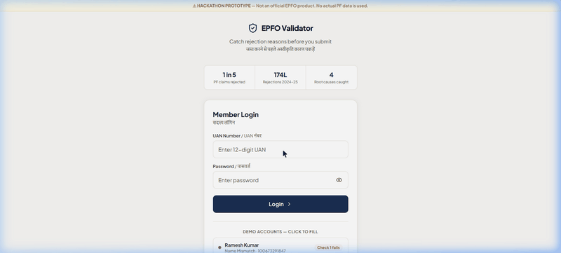

# EPFO PF Claim Pre-Validator

A rebuilt EPFO portal that runs 4 automatic pre-validation checks before any PF claim is submitted, tells the member exactly what will cause rejection, and generates the specific document needed to fix it.

> **Hackathon Prototype**  
> Independent project — Not affiliated with EPFO or the Government of India.

## Workflow Demo

## The Problem

174 lakh PF claims were rejected in 2024-25 — 1 in every 5. The current EPFO portal rejects with a generic code. No explanation. No fix path. Workers often have to visit EPFO offices multiple times to figure out why.

## The Solution

A pre-validation layer inserted *before* submission — not after rejection.

**4 automatic checks run before claiming:**
1. **Name Match** — EPF records vs. Aadhaar (AI-powered fuzzy matching via GPT-4.5)
2. **Date of Birth** — EPF records vs. Aadhaar
3. **Employer Exit Date** — Ensuring the previous employer updated the UAN
4. **Bank KYC** — Account is linked and employer-approved

**For each failure:** 
You get a plain-language explanation + numbered fix steps + auto-generated documents (like a Joint Declaration, employer letter, or EPFiGMS complaint).

## Demo Accounts

| Account       | UAN           | Password   | Scenario              |
|---------------|---------------|------------|-----------------------|
| Ramesh Kumar  | 100673291847  | Demo@1234  | Name mismatch         |
| Fatima Shaikh | 100891234567  | Demo@1234  | Multiple failures     |
| Vijay Patil   | 100334455678  | Demo@1234  | All clear (happy path)|

## Quick Start (Local Setup)

1. Clone the repository and install dependencies:
\\ash
npm install
\
2. Copy the environment template:
\\ash
cp .env.example .env.local
\
3. Add your \VITE_AI_PROVIDER\ and \AI_API_KEY\ to \.env.local\.

4. Start the development server:
\\ash
npm run dev
\
## Technologies Used

- **React & Vite**: Fast, modern frontend framework and build tool.
- **Tailwind CSS v4**: Utility-first CSS for responsive, accessible styling.
- **Framer Motion**: Smooth animations and fluid UI transitions.
- **Zustand**: Lightweight global state management.
- **React Router**: Client-side routing for the multi-step validation flow.
- **jsPDF**: Client-side PDF generation for downloading resolution documents.
- **GPT-4.5 (via Serverless API)**: AI model used to perform intelligent fuzzy matching (e.g., name comparisons) securely.

## How It's Built

1. **Client-Side Architecture**: The core application runs entirely in the browser. It simulates the EPFO process by passing mock user data through a strict rule engine (the Validation Engine).
2. **AI Pre-validation**: Before submission, the app uses GPT-4.5 to intelligently compare records (like Name Matching). The AI call is routed securely through a Vercel Serverless Function proxy (\/api/ai\) to hide API keys from the browser.
3. **Automated Document Generation**: When a mismatch is detected, the app automatically drafts the exact document required (e.g., a Joint Declaration) and generates a downloadable PDF directly on the client side using \jsPDF\.
4. **Accessible UI/UX**: The interface replaces the clunky government portal with a modern, responsive, mobile-first design, featuring bilingual support (English/Hindi) and an accessible journey map.

## Deployment

Deploy seamlessly to Vercel:
\\ash
npx vercel --prod
\Make sure to add \AI_API_KEY\ in Vercel → Settings → Environment Variables.
